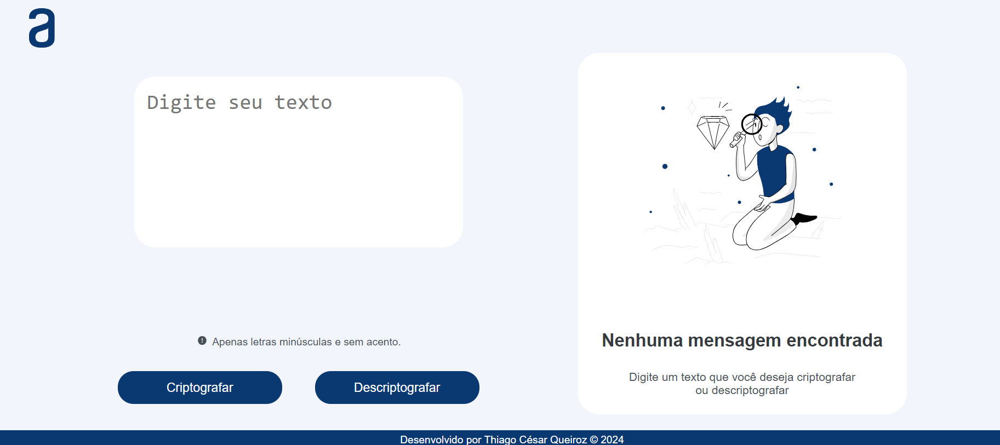
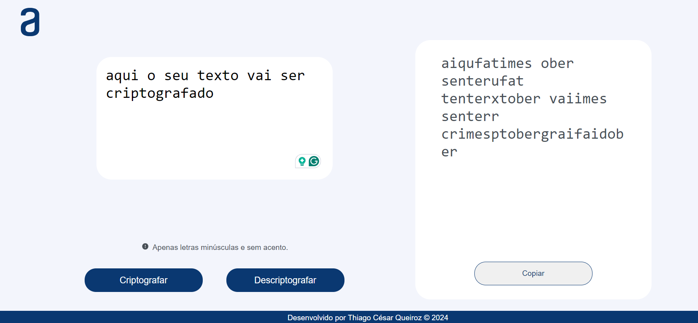
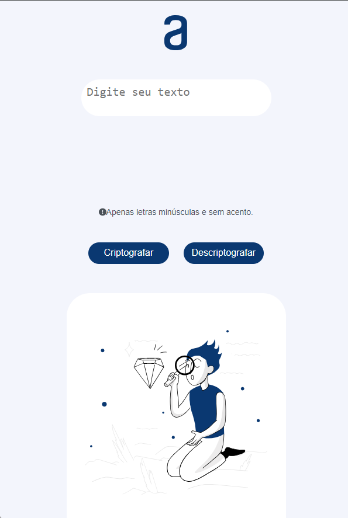

<h1 align="center"> Decodificador de Texto </h1>

Desenvolvido por: Thiago César Queiroz

## Índice

* [1. Resumo do projeto](#1-resumo-do-projeto)
* [2. Objetivos de aprendizagem](#2-objetivos-de-aprendizagem)
* [3. Resultado do Projeto](#3-resultado-do-projeto)
* [4. Tecnologias Utilizadas](#4-tecnologias-utilizadas)

***

## 1. Resumo do Projeto

Desenvolvimento de um Decodificador de Texto responsivo com o principal objetivo criptografar e descriptografar palavras. Desafio proposto aos alunos pela ONE Oracle Next Education - TURMA 07 em parceria com a Alura.

Sobre o desafio:
As "chaves" de criptografia Utilizadas:

`A letra "e" é convertida para "enter"`

`A letra "i" é convertida para "imes"`

`A letra "a" é convertida para "ai"`

`A letra "o" é convertida para "ober"`

`A letra "u" é convertida para "ufat"`

### Requisitos:

 Funcionar apenas com letras minúsculas.

- Utilizar letras sem acentos ou caracteres especiais.

- Converter uma palavra para a versão criptografada e retornar uma palavra criptografada para a versão original.
   
      Exemplo:
   
      "gato" => "gaitober"
   
      "gaitober" => "gato"

- Ter campos para inserção do texto a ser criptografado ou descriptografado, e o usuário deve poder escolher entre as duas opções.

- O resultado deve ser exibido na tela.

### Extra:

- Um botão que copie o texto criptografado/descriptografado para a área de transferência - ou seja, que tenha a mesma funcionalidade do ctrl+C ou da opção "copiar" do menu dos aplicativos.

## 2. Objetivos de aprendizagem

- HTML
- CSS / Medias Querys
- Lógica de Programação com JavaScript

## 3. Resultado do Projeto

##### Desktop

###### Proposta

###### Resultado Final

##### Mobile

## 4. Tecnologias Utilizadas

     
